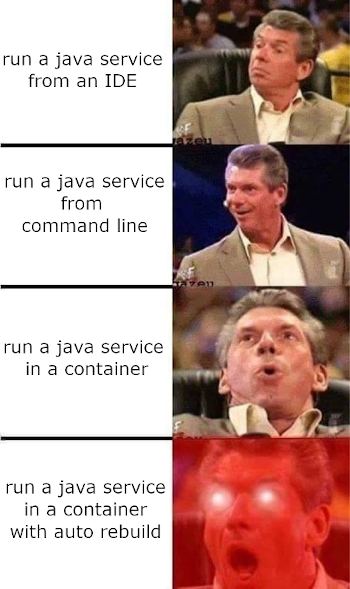
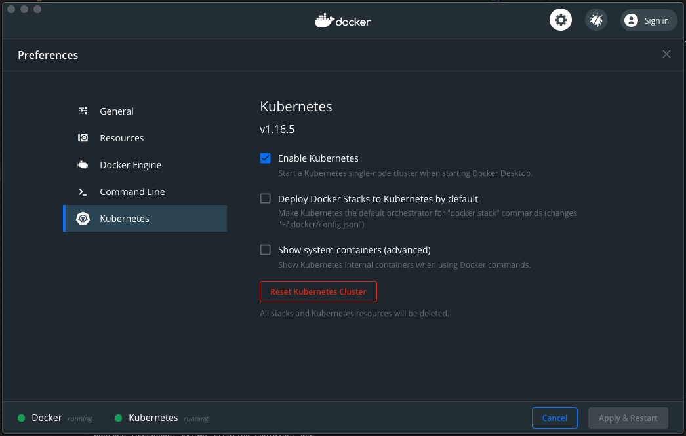

# Deving Java Service in a Container



Hello World Java service running in Docker for Desktop.

Using [jib](https://github.com/GoogleContainerTools/jib) and [skaffold](https://skaffold.dev/) to auto build the container.

Jib will build a docker container that will be published to the local docker registry.

Skaffold will listen for changes and redeploy the image automagically.

## Prereqs

Assumes that the Java SDK is already installed.  
Install [Maven](https://maven.apache.org/)  
Install [Docker for Desktop](https://www.docker.com/products/docker-desktop)  
Install [Skaffold](https://skaffold.dev/docs/install/)  

Enable Kuberneties on Docker for Desktop by going to Preferences and checking "Enable Kubernetes"



## Quick Start

Run `skaffold dev` to build, run the container and start the watcher. Navigate to `http://localhost:8080/` and the app should be running! 
  
Edit `IndexController.java` and change "Hello World" to "Sup World". Skaffold will rebuild and republish the image. Refresh the browser to see the change. 

## Step by Step

### Java Service App

Generate a simple [Java Spring Web App](https://start.spring.io/#!type=maven-project&language=java&platformVersion=2.3.1.RELEASE&packaging=jar&jvmVersion=1.8&groupId=com.javaincontainer&artifactId=demo&name=demo&description=Demo%20project%20for%20simple%20java%20service&packageName=com.javaincontainer.demo&dependencies=web)

Add a new Controller `IndexController.java` in the same directory as the `DemoApplication.java`:

```java
package com.javaincontainer.demo;

import org.springframework.web.bind.annotation.GetMapping;
import org.springframework.web.bind.annotation.RestController;

@RestController
public class IndexController {
  @GetMapping("/")
  public String greeting() {
    return "Hello World!";
  }
}
```

Download the maven wrapper with `mvn -N io.takari:maven:wrapper`  

Run the app with `./mvnw spring-boot:run` (`mvnw.cmd` on windows) and navigate to `http://localhost:8080/` to be greeted with a simple "Hello World".

Next is running the app in a docker container using [jib](https://github.com/GoogleContainerTools/jib)

### Jib
Jib is added as a maven plugin by editing the `pom.xml`. This will create an image called `javaincontainer` and expose the `8080` port and `5005` (for remote debugging). 

```xml
<plugins>
  ...
  <plugin>
    <groupId>com.google.cloud.tools</groupId>
    <artifactId>jib-maven-plugin</artifactId>
    <version>2.4.0</version>
    <configuration>
      <to>
        <image>javaincontainer</image>
      </to>
      <container> 
        <ports>
          <port>8080</port>
          <port>5005</port>  
        </ports>
      </container> 
    </configuration>
  </plugin>
  ...
</plugins>
```

Build the docker image by running:
```
./mvnw compile jib:dockerBuild
```
This will create the `javaincontainer` image and publish to local docker.
  
Execute `docker images` to check if the image exists.  
  
With the image created you can run in docker with:
```
docker run --publish=8080:8080 javaincontainer
```
With the app now running as a docker container, visit `http://localhost:8080/` to get greeted!

Next up is using [skaffold](https://skaffold.dev/) to auto rebuild and republish the container.

### Skaffold


Create a `skaffold.yaml` file in the root of the project:

```yaml
apiVersion: skaffold/v2beta5
kind: Config
build:
  local:
    push: false
  artifacts:
  - image: javaincontainer
    context: .
    jib: {}
```

This will use the local registry for the image `javaincontainer` and use jib for image building. 

Next define the k8s manifest for the service. Create a new dir `k8s` and create a new file `web.yaml` with a [simple service definition](k8s/web.yaml).

Run `skaffold dev` to rebuild the image and automatically deploy to the local Docker for Desktop. visit `http://localhost:8080/` to get greeted once again!  
Now is when the real magic happens. Edit `IndexController.java` and change "Hello World" to "Sup World". Skaffold will automatically kick off the build and update your docker container. Once the rebuild is done, refresh the browser to be greeted with "Sup World"!

You can also debug! The container exposes port `5005` for debugging that you can attach to.


